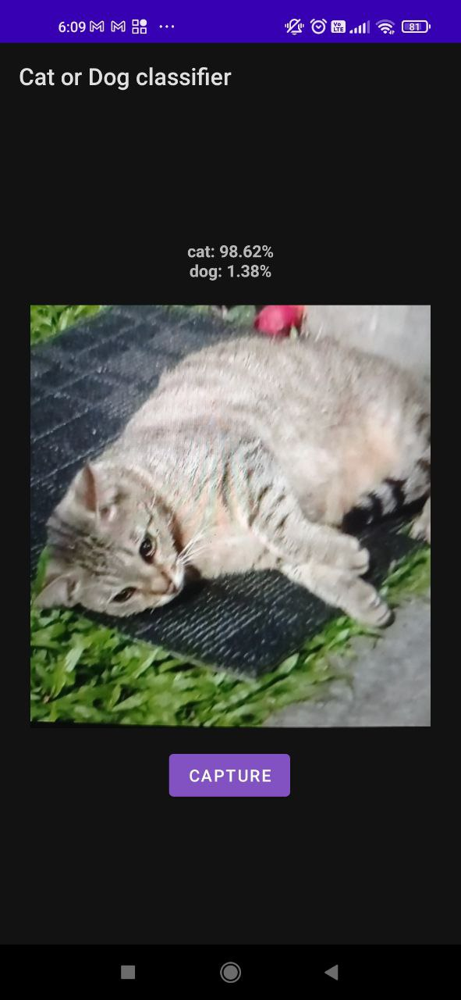
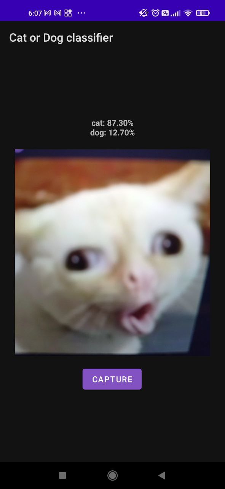
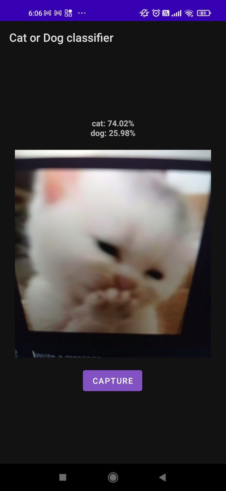

# Cat Dog AI camera

Cat Dog AI Camera is an Android application that allows users to take pictures of cats or dogs and perform AI inference on them using a deep learning server. The app uses a custom deep learning model trained on a large dataset of cat and dog images to classify the images with reasonable precision.
  
This project mostly serves to demonstrate the offloading of AI inference from an IoT device to the cloud. The client side application could certainly be rebuilt using other cross-platform frameworks like flutter.

<table>
  <tr>
    <td></td>
    <td></td>
    <td></td>
  </tr>
</table>

## Features
- Take pictures using the phone's camera.
- Send the captured image to a remote deep learning server for inference.
- Display the predicted label and confidence score of the image classification result.

## Technologies Used
- TensorFlow
- Flask
- Android Studio

